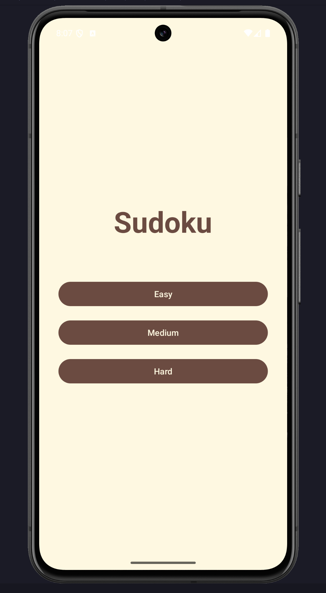

# Sudoku - A classic Android game in Java

  

An Android Sudoku app with a Compose-based difficulty selector (`HomeActivity`) that launches a Java + ViewBinding game screen (`MainActivity`). The game logic lives in an MVVM stack powered by `SudokuViewModel`, `LiveData`, and the `SudokuBoard` model, keeping the UI responsive while puzzles are generated on a background thread.

## Screenshots

|                      New Game Dialog                      |                  Game Screen                   |
| :-------------------------------------------------------: | :--------------------------------------------: |
|  |  |

## Features

- **Fresh puzzles per game**: Generates solvable boards with a uniqueness check before play starts.
- **Difficulty selector**: Easy, Medium, or Hard chosen on the Compose home screen.
- **Real-time validation**: Highlights wrong entries immediately; per-move scoring and an error counter keep feedback clear.
- **Timer and scoring**: Time-based bonus plus difficulty bonuses; score never drops below zero.
- **Undo support**: Revert the latest user move while keeping score and error counters in sync.
- **Config-change safe**: Board state, selection, timer, and counters survive rotations and process death via the ViewModel bundle.

## Architecture in brief

- **UI flow**: `HomeActivity` (Compose difficulty picker) ➜ `MainActivity` (ViewBinding screen + overlayed `TextView`s for numbers).
- **Rendering**: `SudokuGridView` draws the grid; `HighlightOverlayView` draws selection/highlight layers.
- **State + logic**: `SudokuViewModel` owns UI state with `LiveData`, delegates rules and move history to `SudokuBoard`/`SudokuCell`.
- **Background work**: Puzzle generation runs on a single-thread executor; a `Handler` drives the in-app timer on the main thread.
- Read the full breakdown in `docs/ARCHITECTURE.md`.

## Project structure

```
app/src/main/java/com/example/sudoku
├── HomeActivity.kt            # Compose launcher that passes the chosen difficulty to MainActivity
├── MainActivity.java          # ViewBinding UI, observers, dialogs, keypad, highlight overlay hookup
├── SudokuGridView.java        # Custom view that draws the 9x9 board background and grid lines
├── HighlightOverlayView.java  # Selection, row/column, and block highlighting overlay
├── SudokuBoard.java           # Core logic: puzzle generation, validation, scoring, move history
├── SudokuCell.java            # Parcelable cell model (value, fixed flag, correctness, notes)
└── viewmodel/SudokuViewModel.java  # LiveData state holder, timer, undo, and move handling
```

Resources live in `app/src/main/res`; Compose theme definitions are under `app/src/main/java/com/example/sudoku/ui/theme`.

## Getting started

Prerequisites: Android Studio (Koala+ recommended), JDK 21, Android SDK 36; the app currently targets and requires Android 14 (minSdk 34).

1. Clone the repo: `git clone https://github.com/<your-username>/Basic_Sudoku.git`
2. Open the project in Android Studio and let Gradle sync.
3. Pick a device/emulator running Android 14+ and press Run, or build from the CLI with `./gradlew assembleDebug`.

## Development and testing

- Quick build: `./gradlew assembleDebug`
- Unit/UI tests: none are present yet; add them under `app/src/test` or `app/src/androidTest` and run with `./gradlew test` or `./gradlew connectedAndroidTest`.
- Code style: Kotlin uses the official style; Java follows standard Android conventions and lives alongside Compose code where needed.
- More tips live in `docs/DEVELOPMENT.md`.

## Documentation

- `docs/ARCHITECTURE.md`: deeper dive into the UI flow, threading, scoring, and puzzle generation.
- `docs/DEVELOPMENT.md`: environment setup, build commands, and guidelines for extending the app.

## License

This project is licensed under the MIT License - see the `LICENSE` file for details.
