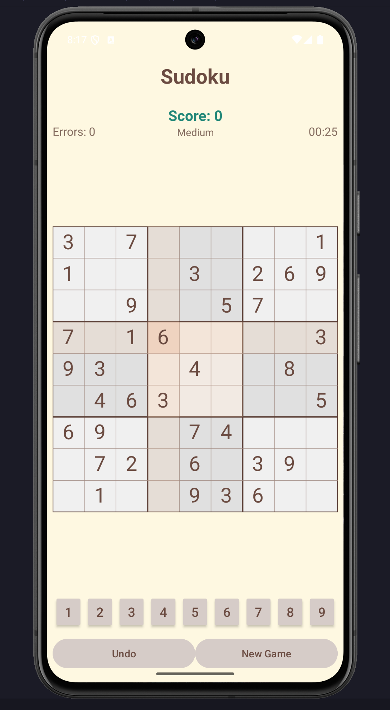

# Sudoku - A classic Android game in Java


A clean, user-friendly, and (maybe in future) feature-rich Sudoku application for Android, built entirely in Java. This project showcases the implementation of a classic logic puzzle using modern Android development principles and Jetpack components. The focus is on robust architecture, state management, and a smooth user experience.

## Screenshots

|                  Game Screen                   |                      New Game Dialog                      |
|:----------------------------------------------:|:---------------------------------------------------------:|
|  |  |

## Features

- **Dynamic puzzle generation**: A new, unique, and solvable Sudoku puzzle is generated every time you start a new game.
- **Multiple difficulty levels**: Choose between Easy, Medium, and Hard to match your skill level.
- **Interactive and responsive grid**: A custom-drawn grid with an intuitive interface for selecting cells and inputting numbers.
- **Real-time move validation**: User inputs are instantly checked against the actual solution. Incorrect numbers are highlighted, providing immediate feedback.
- **Error counter**: Keep track of your mistakes with a simple error counter.
- **Dynamic scoring system**: Your score is calculated based on difficulty, time elapsed, and errors made.
- **Game timer**: A running clock to track how long a puzzle takes to solve.
- **Undo last move**: Made a mistake? Easily undo your last move.
- **Game state persistence**: The current game state, including the board, selected cell, and timer, is saved and restored during configuration changes (like screen rotation).

## Technical stack and architecture

This project is built following modern Android architecture guidelines to ensure it is scalable, maintainable, and robust.

- **Language**: **Java**
- **Architecture**: **MVVM (Model-View-ViewModel)**
    - **View**: The `MainActivity` is responsible for observing data and updating the UI. It delegates all logic to the ViewModel.
    - **ViewModel**: `SudokuViewModel` holds and processes all UI-related data. It survives configuration changes, preventing data loss.
    - **Model**: The `SudokuBoard` and `SudokuCell` classes represent the game's data and core logic, completely decoupled from the Android Framework.
- **Android Jetpack Components**:
    - **ViewModel**: To manage UI-related data in a lifecycle-conscious way.
    - **LiveData**: To build data objects that notify views when the underlying database changes. Used for communication between the `ViewModel` and the `Activity`.
    - **ViewBinding**: To safely and easily interact with views defined in XML layouts.
- **UI**:
    - **XML Layouts**: For defining the static UI structure.
    - **Custom Views**: `SudokuGridView` is a custom-drawn view responsible for rendering the grid lines and block backgrounds efficiently.
- **Asynchronous Operations**:
    - A `Handler` is used within the `ViewModel` to manage the game timer without blocking the main thread.

## Project structure

The codebase is organized into logical packages to promote a clean separation of concerns.

```
com.example.sudoku
│
├── MainActivity.java           // Main UI Controller (View)
├── SudokuGridView.java         // Custom View for the grid background and lines
│
├── viewmodel/
│   └── SudokuViewModel.java    // The ViewModel (MVVM)
│
└── model/                      // (Implicit package for model classes)
    ├── SudokuBoard.java        // Core game logic, state, and puzzle generation
    └── SudokuCell.java         // Data class for a single cell on the board
```

## How to set up and run

1. **Clone the repository**:

    ```bash
    git clone https://github.com/YOUR_USERNAME/YOUR_REPOSITORY_NAME.git
    ```

2. Open the project in **Android Studio**.
3. Let Gradle sync and download the required dependencies.
4. Build and run the app on an Android emulator or a physical device.

## License

This project is licensed under the MIT License - see the [LICENSE.md](LICENSE.md) file for details.

---
